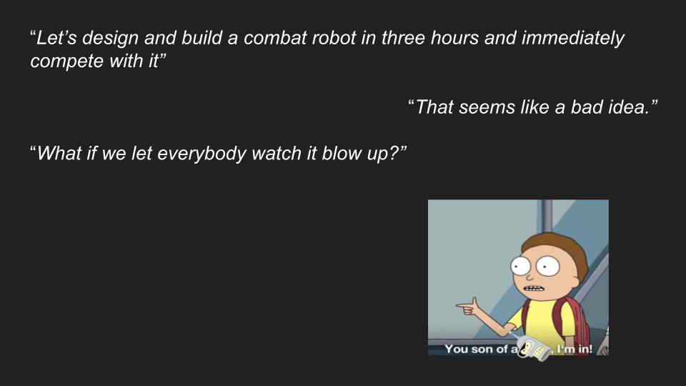
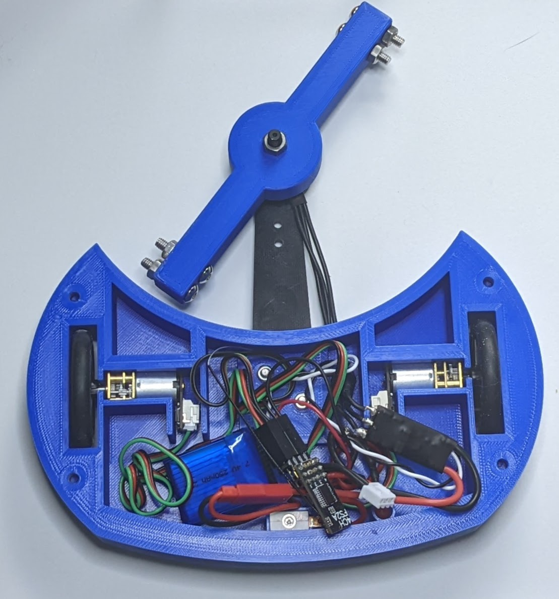
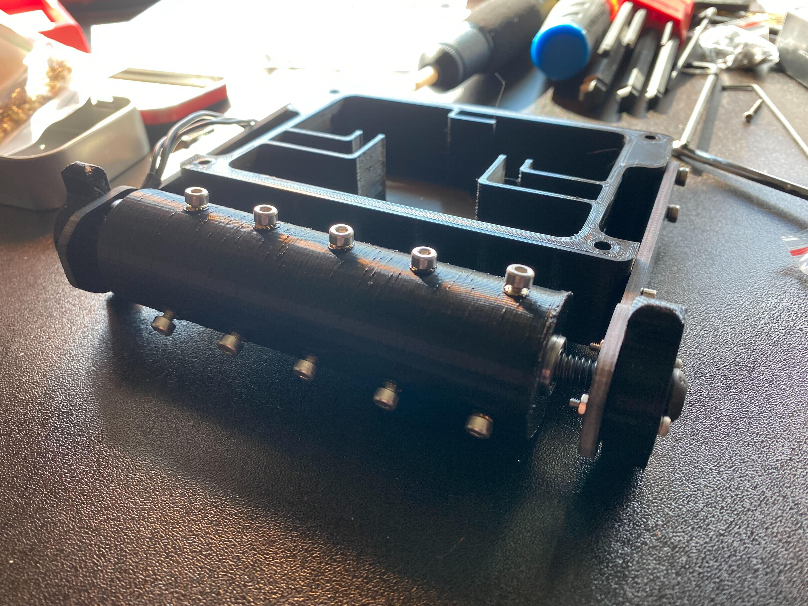
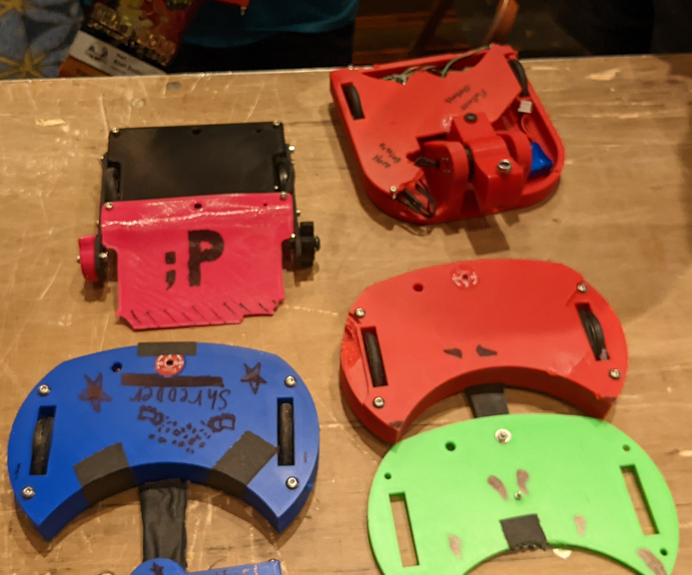

# Combat Robotics in Three Hours

#### Welcome to Combat Robotics in Three Hours (CRi3H).  Our mission is to spread the fun of combat robotics, with a focus on affordable, approachable ways to get started.

## Origins

CRi3H is inspired by the 'Robot in 3 Days (Ri3D)' challenge, which is done every year as part of the kickoff week for the [First Robotics Competition](https://www.firstinspires.org/robotics/frc) season.  Using that as a model, we set out to design, manufacture, wire, and assemble a small combat robot within 3 Hours.  We then immediately take the robots to compete.  They might work, or they might rapidly disassemble themselves.  Either way, it's guaranteed to be a good time!

## CRi3H History

At [DragonCon](https://www.dragoncon.org/) 2022, we debuted CRi3H as part of the Robotics and Maker track.  We succeeded in building 3 ant-weight robots on-site and competing in [Robot Battles](http://www.robotbattles.com/), which is hosted at the convention every year.  We're coming back for 2023 with more content, and more bots!

### 2022 Bots

## Disclaimers

* We have no idea what we’re doing.
* Don’t believe anything we say.
* Wear your safety glasses.

Although we have a fair bit of experience in robotics, engineering, and software, we're not professionals.  Please be sure to take all safety precautions necessary.  Even the smallest combat robots are capable of causing serious injuries.

## How to sessions
* [Hour 1 - Getting started and design](sessions/session1/)
* [Hour 2 - Wiring and Assembly](sessions/session2/)
* [Hour 3 - Final Assembly and Controllers](sessions/session3/)

## The bots
* [Level 1: Mini-T](bots/mini-t/)
* [Level 2: Shr3dr](bots/shr3d3r/)
* [Level 3: Viper(kit)](bots/viper/)

## Our Sponsors

