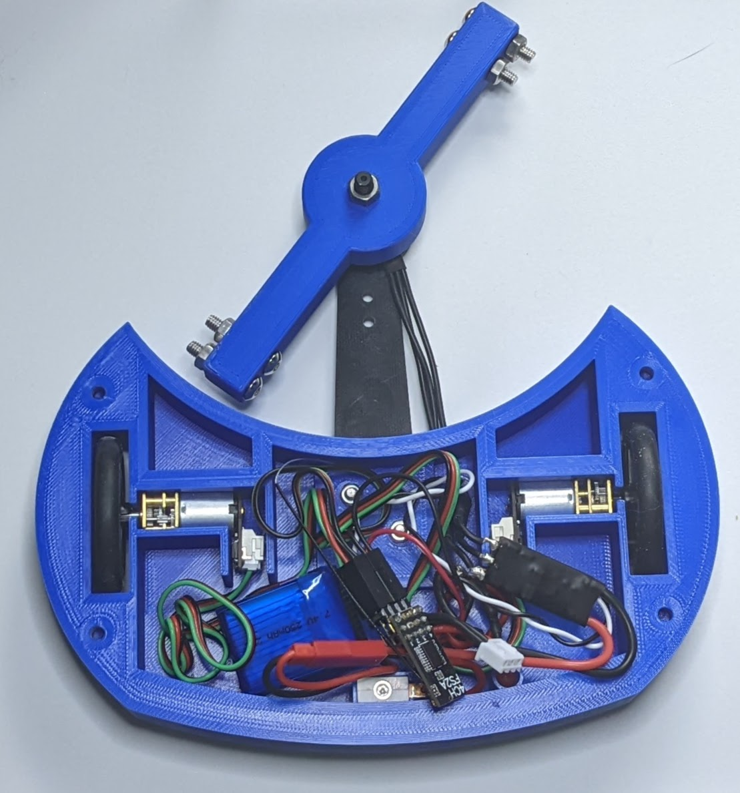
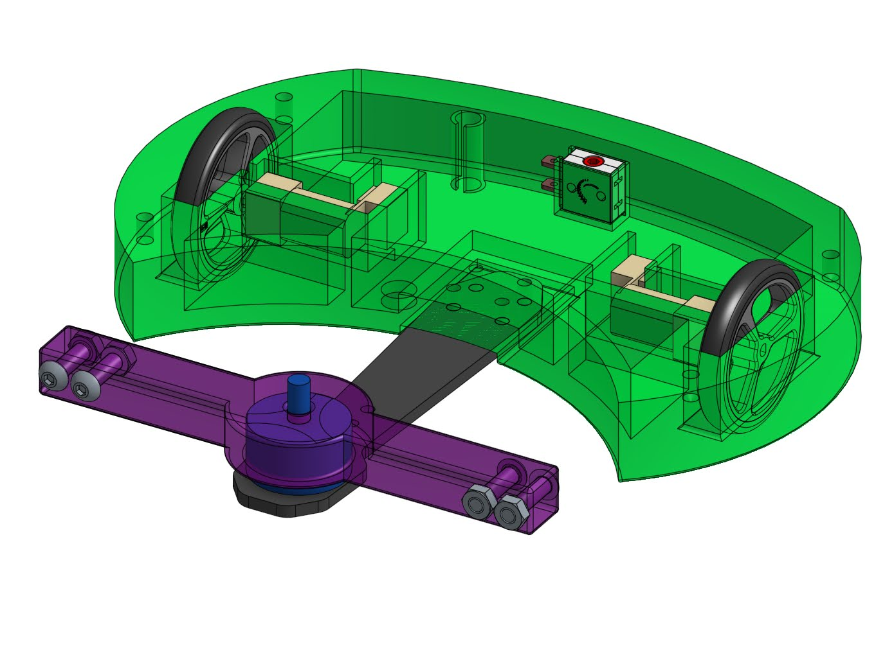

# Mini T aka Mini Tombstone

Mini T is an ant-weight bot inspired by the famous Tombstone, built by Ray Billings.  It features a 3d printed chassis with a printed horizontal spinner with metal 'teeth' in the form of bolts put through the arm.  It can be built for around $150, including the radio controller.

## Pictures

## CAD files
#### [Mini-T CAD (Onshape)](https://cad.onshape.com/documents/8284261934fcd55d82bc3537/w/920f2ca48e9a7e7adbf05e19/e/7e0400d991510fcbada9d427)

## STLs
### [Download STLs](images/little-t.zip)

## Bill of Materials
|Part        |Description |Price       |Link        |
|------------|------------|------------|------------|
|Drive Motors|DC Micro Metal Gear Motor|$12.00|https://www.dfrobot.com/product-1488.html|
|Weapon Motor|Brushless DC Motor MTO1804 w/ ESC|$29.00|https://www.dfrobot.com/product-1959.html|
|Wheels      |Pololu Wheel Pair|$4.95|https://www.pololu.com/product/1452|
|Weapon      |3 MM Glass Fiber Drone Arm|$4.33|https://www.aliexpress.us/item/2251832296591086.html|
|Radio Transmitter|Flysky FS-i6X|$53.99|https://a.co/d/2b3w7lL|
|Radio Receiver|Mini Compatible Receiver|$16.89|https://www.amazon.com/gp/product/B081CJFVFV|
|Battery|2S Lipo Battery|$10.50|https://itgresa.com/product/galaxy-300mah-2s-lipoly-battery/|
|Battery Charger|Dual 2S Charger|$10.00|https://itgresa.com/product/2s-lipoly-charger-with-two-outputs/|
