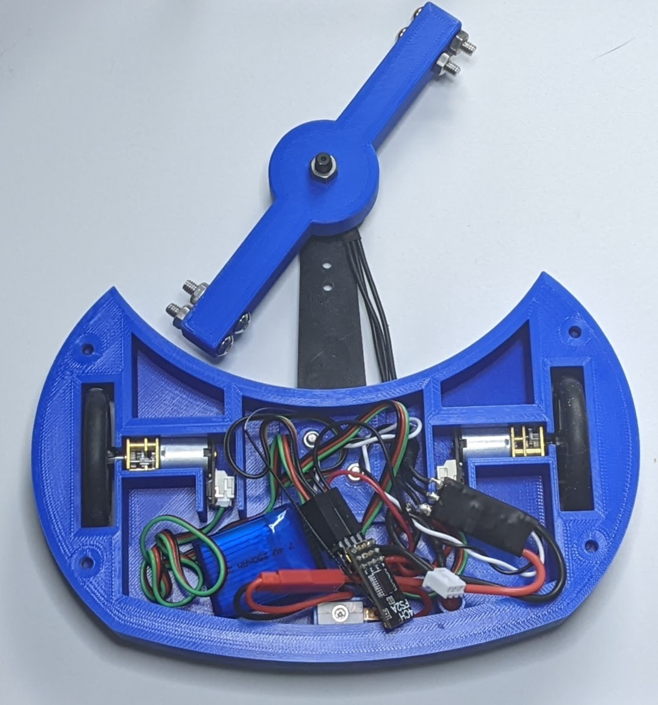
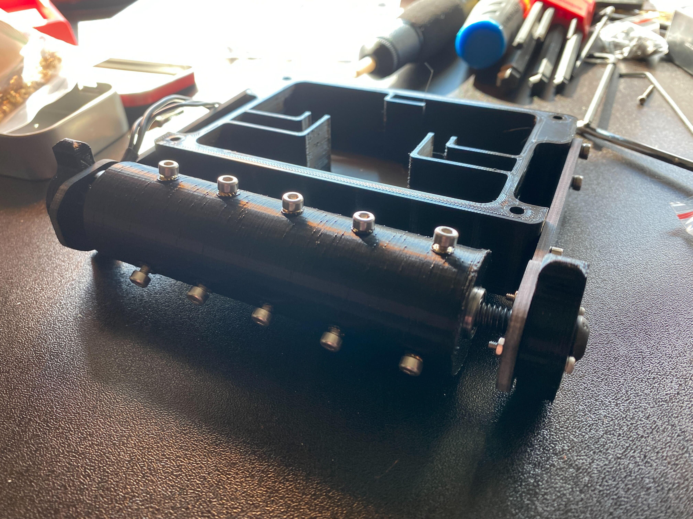

#  Hour 1 - Getting Started
## Overview/Agenda

* **Session 1 - Getting started and design** (You are here!)
* *Session 2* - Wiring and Assembly
* *Session 3* - Final Assembly and Controllers!
* *Session 4* - *FIGHT*

## Previous Bots

## Finding Information

* Out of the Arena Discord - https://discord.gg/oota 
* YouTube 
  * CNC Kitchen - https://www.youtube.com/c/CNCKitchen 
  * Robert Cowan - https://www.youtube.com/c/RobertCowanDIY 
  * Team Panic - https://www.youtube.com/c/TeamPanicRobotics 
* Dragon Con Robot Battles - http://www.robotbattles.com/ 

## What type of robot should I build?

### Weight Classes

* *Fairyweight - 0.33lb (150 g)*
* **Antweight - 1 lb (450 g)**
* *Beetleweight - 3 lb (1.4 kg)*
* Mantisweight - 6 lb (2.7 kg)
* *Hobbyweight - 12 lb (5.4 kg)*
* Dogeweight - 15 lb (6.8 kg)
* *Featherweight - 30 lb (14 kg)*
* Lightweight - 60 lb (27 kg)
* Middleweight - 120 lb (54 kg)
* Heavyweight - 220 lb (100 kg) (250 lb)

### Common types of bots

* Wedges
* Lifters/Flippers/Hammers
* **Drum spinners**
* **Horizontal Spinners**
* **Vertical Spinners**
* Full Body Spinners 
* Melty Brains

## Kit or DIY

### Kits
#### Pros
* Easiest way to get started
* Great if you don’t have a 3D printer
* Less chance you’ll break something
* Probably more competitive to start
#### Cons
* More expensive - Maybe
* Less Choice

### DIY
#### Pros
* Full control
* Builds the skills you’ll need later
* Can be cheaper - Maybe
* We think it’s more fun

#### Cons
* Steeper learning curve
* Can feel like too many choices
* Need more tools (Check for Maker Spaces and Library!)

## Design
* TinkerCAD
* Fusion 360
* Onshape
* So Many More
####  Let's design a robot

##  Slicing and Printing
* PLA+/PETG vs ABS/ASA/TPU/Nylon
* Make your shells thick!
* You don’t need 100% infill!
#### Loaded into the slicer

#### 15 Hours Later....

