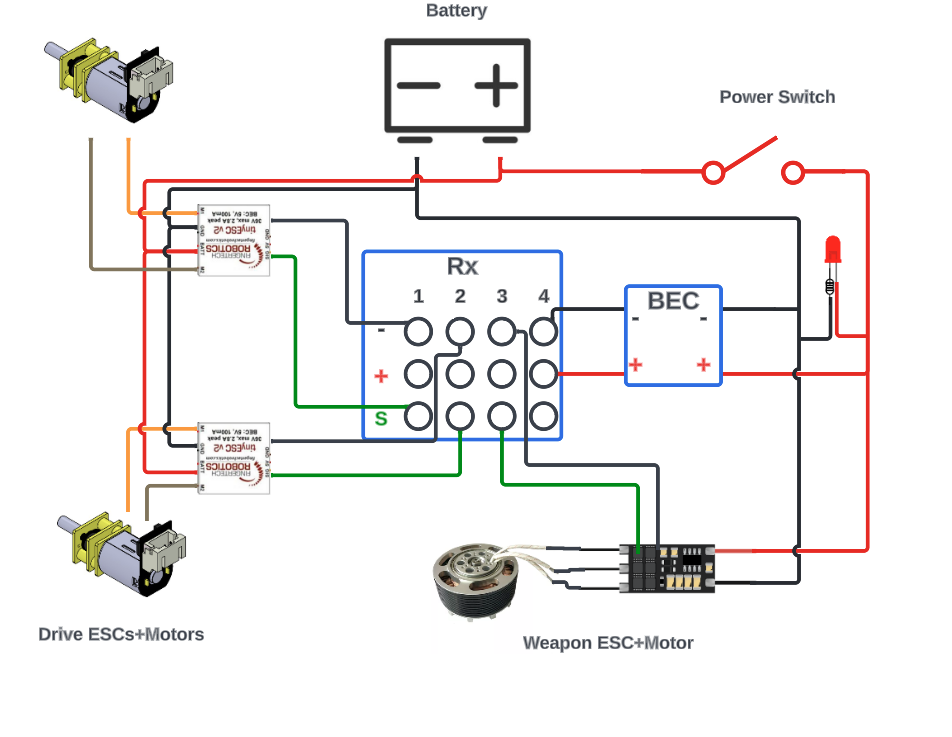
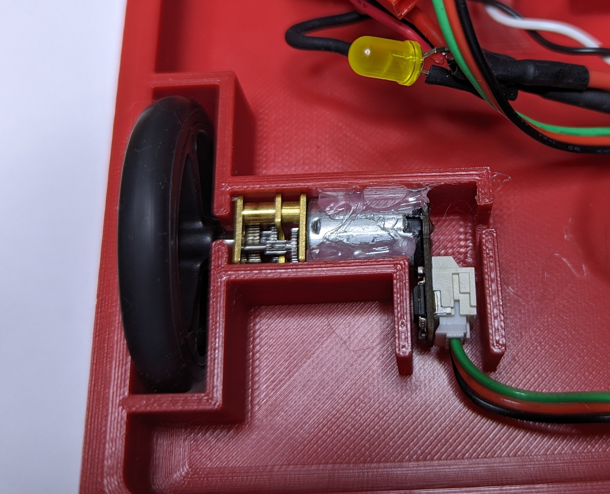
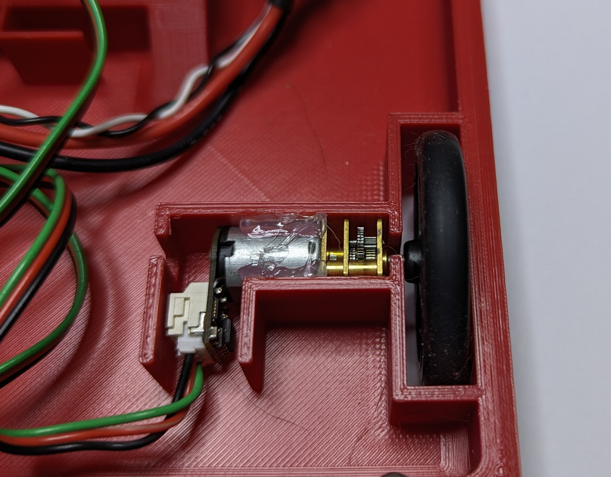
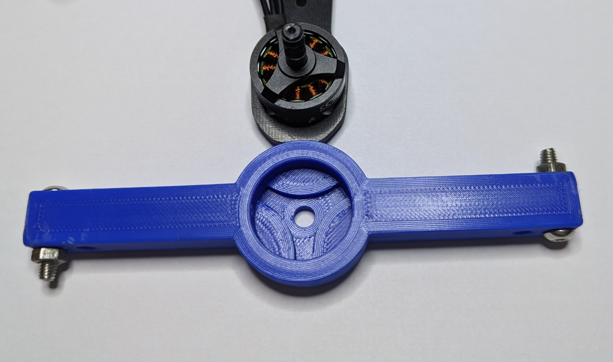
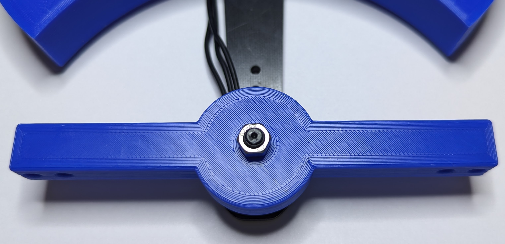
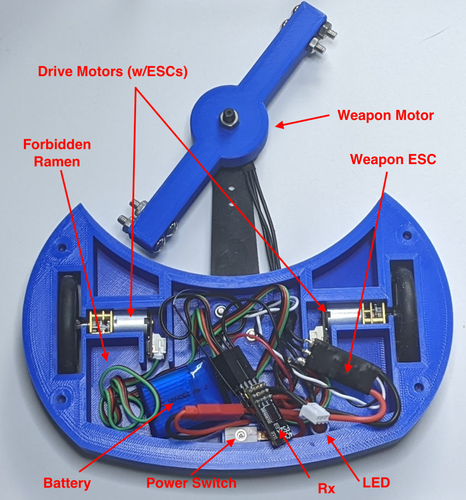

#  Hour 2 - Wiring and Assembly

## Overview/Agenda

* *Session 1* - Getting started and design 
* **Session 2 - Wiring and Assembly** (You are here!)
* *Session 3* - Final Assembly and Controllers
* *Session 4* - *FIGHT*

## Assembling your robot
* Make sure it fits
* Wiring
* Drivetrain installation
* Weapon installation
* Hope it's not too heavy
* Freak out

## Wiring

### Common Electrical Setup

### Electrical Setup with built-in ESCs

## Assembly
### Drivetrain Install

### Weapon Install

## It fits! (sorta)

