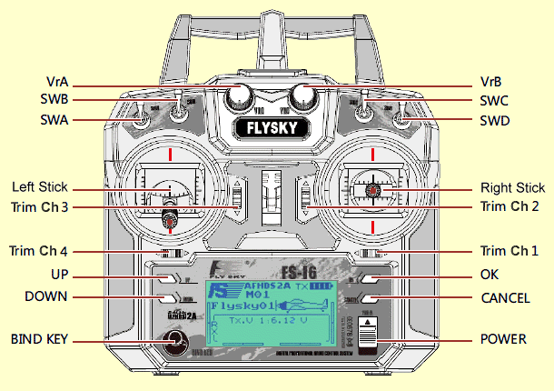
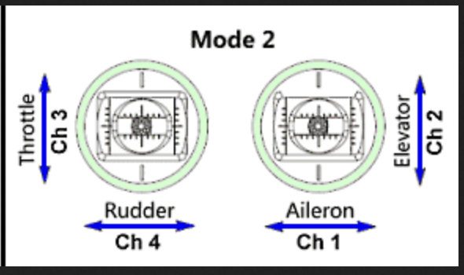

#  Hour 3 - Final Assembly and Controllers

## Overview/Agenda

* *Session 1* - Getting started and design 
* *Session 2* - Wiring and Assembly 
* **Session 3 - Final Assembly and Controllers** (You are here!)
* *"Session 4"* - *GO FIGHT*

## The final countdown
* Final Assembly
* Controller Setup
* Testing

## Final Assembly

## Controller Setup



## Safety ~~third~~ **FIRST**

- **Eye protection** is the most important item!  Even the smallest bot can blind you.
- Use a test box to test your bot, or set up a camera and test your bot 'remotely'.
- Always follow the proper startup/shutdown procedure, in order!
  1. Make sure controller is zeroed
  1. Turn on the controller
  1. Turn on the bot
  1. Test!
  1. Turn off the bot
  1. Turn off the controller

## Now what?
Now you've got a robot, so what are you gonna do with it?   Here are a few ways to find a battle.

### Finding a competition
- [Robot Battles at DragonCon](http://www.robotbattles.com/)
- [BuildersDB](https://www.buildersdb.com/)
- [Robot Combat events](https://www.robotcombatevents.com/)

